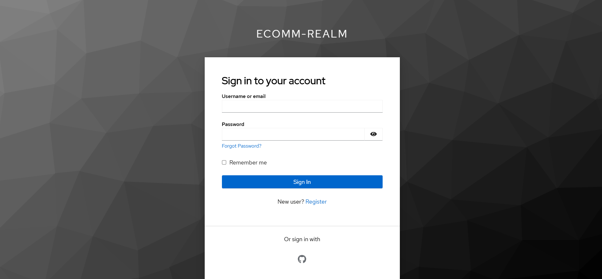
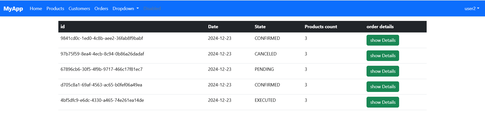
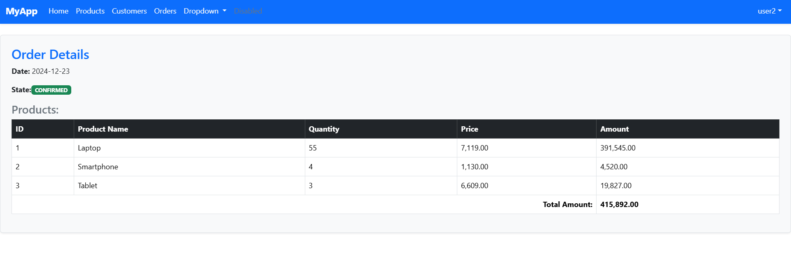

# My Full-Stack Application 🚀

A full-stack application built with **Spring Boot**, **Angular**, and **Keycloak** for authentication.

## Features
- User authentication with Keycloak
- Responsive frontend with Angular
- RESTful API backend with Spring Boot
- Clean architecture and code organization

## Screenshots

### Kycloak interface

### Products List

### orders List

### order Details

